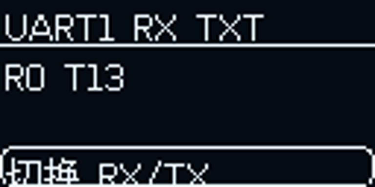

# STM32 BoardScope · 板载状态监测台

[](https://github.com/WU-AetherCore/stm32-boardscope/actions/workflows/build.yml)

基于 STM32F407VET6、FreeRTOS、KK_UI 与 KK_OLED 的中文板级监控工程。
旋转编码器操作 OLED，UART1 每秒输出一组状态，配套中文电脑窗口实时查看。
由 STM32F407VET6-CLion-V1.1 整理，版本 1.1.1。

## UI 预览

以下图片来自已运行板子的 OLED 帧缓冲，用于展示布局。

| 首页 | 串口监测 |
|---|---|
|  |  |

## 功能

- DHT11 温湿度、有效状态、采样年龄、温度上限与报警。
- 五路继电器独立控制；中文滚动菜单、确认弹窗、设备状态与设置。
- UART1–6 选择、RX/TX ASCII/HEX 历史、统计、测试发送、回显和清除。
- SPI Flash JEDEC ID、容量、状态和 16 B 地址浏览，只读。
- 三个普通按键分别预设短按 / 长按 / 双击，默认记录次数，业务使用弱回调扩展。
- CAN 最后接收帧、GPIO A–E 寄存器、软件输出与运行状态。
- FLASH / RAM / CCM、text / data / bss / dec，以及实时 FreeRTOS 堆与任务栈。
- 独立通信任务每秒通过 UART1 输出完整 JSON 行快照，OLED 离线时通信继续工作。
- 中文 Tkinter 监控窗口：模块分组、原始串口数据、断线重连与数据过期提示。

## 硬件

| 功能 | 引脚 / 配置 |
|---|---|
| MCU | STM32F407VET6，168 MHz，512 KiB Flash，128 KiB SRAM，64 KiB CCM |
| UART1 / 电脑 | PA9 TX、PA10 RX，115200 / 8N1，无流控 |
| OLED | PB6 SCL、PB7 SDA，128×64 |
| 编码器 | TIM3 配置；PC2 按压；每档 2 个计数 |
| 普通按键 | PD5 / PD6 / PD7，低电平有效 |
| 继电器1–5 | PE0 / PE1 / PE2 / PD0 / PD1，低电平有效 |
| DHT11 | PB9，2 秒采样 |
| SPI2 Flash | PB12 CS、PB13 SCK、PB14 MISO、PB15 MOSI |
| 蜂鸣器 / LED | PB8；PA4 / PA5 / PA6 |

完整复用原板引脚与外设配置，参见 `.ioc` 和 `Core/Src`。这不是通用开发板自动探测固件。

## 快速开始

需要 CMake 3.21+、Ninja 和 ARM GNU 工具链（含 newlib）。ARM 工具链 bin 加入 PATH，或设置 ARM_TOOLCHAIN_PATH。
CLion 直接打开工程根目录，使用 Debug / Release Preset。

```powershell
cmake --preset Debug
cmake --build --preset Debug --parallel
cmake --preset Release
cmake --build --preset Release --parallel
```

`build/Debug`、`build/Release` 生成 `.elf` / `.hex` / `.bin`。
STM32CubeProgrammer CLI 加入 PATH 后，CMake 提供 `flash` 目标，执行烧录、校验和复位：

```powershell
cmake --build build/Debug --target flash
```

普通编译不会自动烧录。连接多台 ST-Link 时，配置 `-DSTLINK_SERIAL=你的序列号`。

## 电脑实时监控

Python 3.10+（含 Tkinter），先关闭其他占用串口的程序：

```powershell
python -m pip install -r tools/requirements.txt
python tools/boardscope_monitor.py
```

选择 COM6 或实际串口，点击“连接”。每秒刷新完整快照；原始数据页显示 JSON 文本。
完整字段与数据含义见 [串口状态协议](docs/串口状态协议.md)。
UART1 同时保留 STATUS、HELP、RELAY、UI 命令，按 LF / CRLF 结束。

## 板上操作与业务扩展

旋转选择，按下进入；信息页旋转滚动，按下返回。继电器弹窗调整后选择“确定”提交。
三个普通按键不参与 UI：去抖 25 ms、长按 800 ms、双击间隔 300 ms，短按等双击窗口结束后发出。
在独立业务 .c 文件覆盖下列弱函数，回调应快速返回：

```c
void Board_OnKeyEvent(uint8_t key, uint8_t event)
{
    // key: 0/1/2；event: 0 短按、1 长按、2 双击。
}
```

架构和接口见 [工程架构与开发说明](docs/工程架构与开发说明.md)。

## 验证与限制

本地 ARM GCC 13.3.1 的 Debug / Release、主机串口状态机回归和协议回归已通过。
通过 ST-Link 烧录并校验；COM6 实际收到每秒完整状态，中文监控器已用真实板上数据验证。
最新结果见 [板上验证记录](docs/验证记录.md)。GitHub Actions 配置自动编译和主机测试，实际运行结果以 Actions 为准。

电压字段是预设值，实测有效标志固定为 0。继电器状态是软件命令，无触点反馈。
Flash 显示最近查询结果；跨任务快照按字段采样，并非所有外设同时锁存。
UART TX 为 DMA 完成字节，不代表外部接收确认；当前 COM6 → MCU RX 双向链路尚未实测成功。
普通按键实际手势、编码器手感、继电器触点、UART2–6 对端和 CAN 外部通信需按实际硬件验收。
遗留链接脚本仍有 RWX LOAD 段警告；不影响当前烧录校验，但后续调整内存布局时需重新验证。

## 开源许可与致谢

自有业务代码、电脑监控器和说明采用 MIT；第三方各自遵循原许可证。
感谢 [keysking/kk_ui](https://gitee.com/keysking/kk_ui)、KK_OLED、STMicroelectronics、FreeRTOS、ARM CMSIS、U8g2 和文泉驿。
许可证清单见 [THIRD_PARTY_NOTICES.md](THIRD_PARTY_NOTICES.md)。
