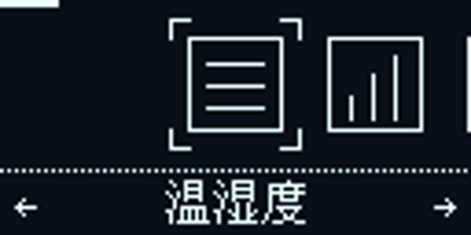
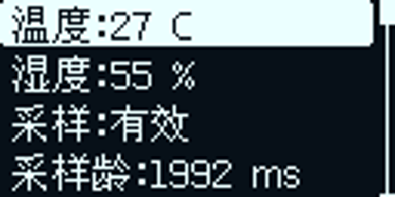

# STM32F407VET6-CLion-V1.2 · Astra BoardScope

使用 [oled-ui-astra](https://github.com/AstraThreshold/oled-ui-astra) 原生 C++ UI 的板级监控工程。
旧 KK_UI/KK_OLED 已停用，继续使用原 OLED 硬件和旋转编码器。V1.0/V1.1 保留。

## 页面

Astra 动画磁贴首页与滚动列表：温湿度、五路继电器、六路串口、SPI Flash、普通按键事件、设备状态（含 CAN/GPIO）、内存状态和设置。
FLASH / RAM / CCM、text / data / bss / dec / hex 与 FreeRTOS 堆、UI 栈实时显示。
UART1 每秒状态上报及中文电脑监控器继续可用，COM6 / 115200 / 8N1。

旋转选择，短按进入或执行，长按返回。继电器确认页默认选中取消。
设置行短按开始编辑，旋转修改，短按保存，长按取消。三个普通按键保留独立短按/长按/双击业务。

128×64 布局已统一：每屏四行，长标签按实际字宽缩短，数字优先完整显示；编辑弹窗按数值宽度调整。UI 按 16 ms 周期运行，屏幕通过 I2C1 中断发送。优化与实测见 [流畅度与布局优化](docs/UI流畅度与布局优化.md)。

## 板上界面预览

以下为实际 MCU 帧缓冲：

| Astra 首页 | 温湿度 |
|---|---|
|  |  |

## 固件下载

[Debug 固件（板上验证版）](firmware/STM32F407VET6-CLion-V1.2-Debug.bin) · [Release 固件](firmware/STM32F407VET6-CLion-V1.2-Release.bin)。BIN 烧录起始地址为 `0x08000000`。版本 1.2.0，旧版在 [v1.1.1 分支](https://github.com/WU-AetherCore/stm32-boardscope/tree/v1.1.1)。

## 编译和烧录

```powershell
cmake --preset Debug
cmake --build --preset Debug --parallel
cmake --preset Release
cmake --build --preset Release --parallel
cmake --build build/Debug --target flash
```

工具链需要 arm-none-eabi-gcc / g++，建议 STM32CubeCLT。CLion 打开本目录。
移植接口、修改清单和内存设计见 [Astra移植说明](docs/Astra移植说明.md)。
板上验证结果见 [V1.2验证记录](docs/V1.2验证记录.md)，截图来自实际 MCU 帧缓冲，不是实屏照片。

## 电脑窗口

```powershell
python -m pip install -r tools/requirements.txt
python tools/boardscope_monitor.py --port COM6 --connect
```

先关闭其他串口软件占用。协议兼容，字段含义见 docs/串口状态协议.md。
电压依旧为预设值，实测有效标志为 0；继电器无触点反馈；Flash 显示最近读取值。
板上调试输入验证不等于真实编码器/按键手势或外部 UART/CAN 对端已验收。

## 许可

组合工程 GPL-3.0，来源和本地修改见 docs/Astra移植说明.md。
原 BoardScope MIT 和其他第三方许可分别保留，见 LICENSES、THIRD_PARTY_NOTICES.md。
